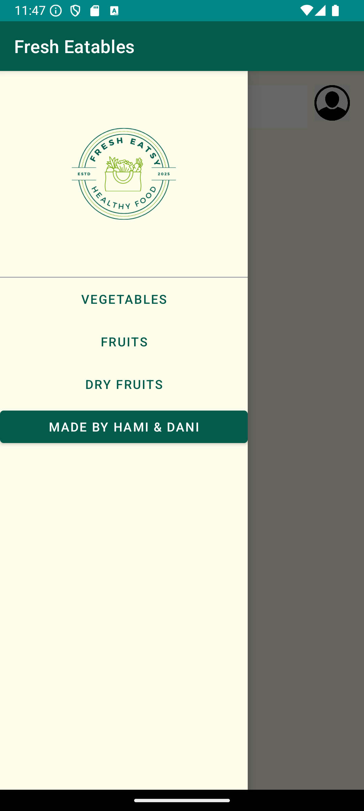
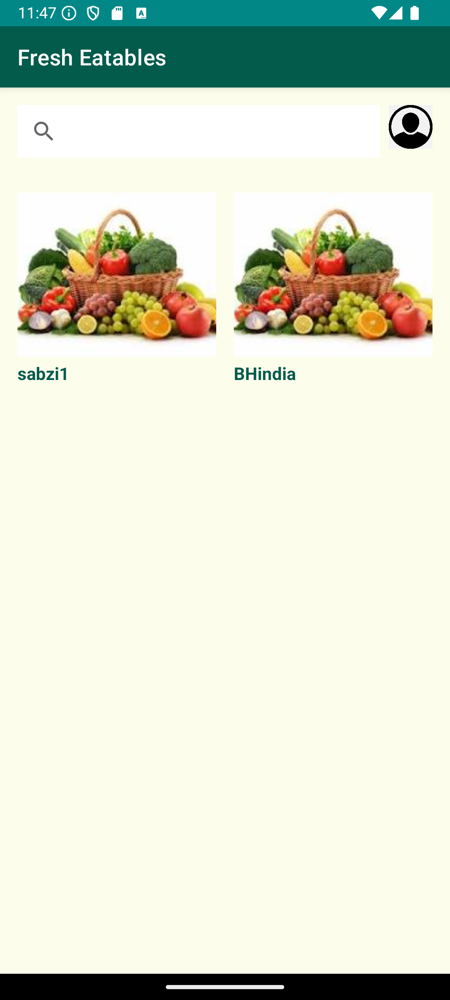
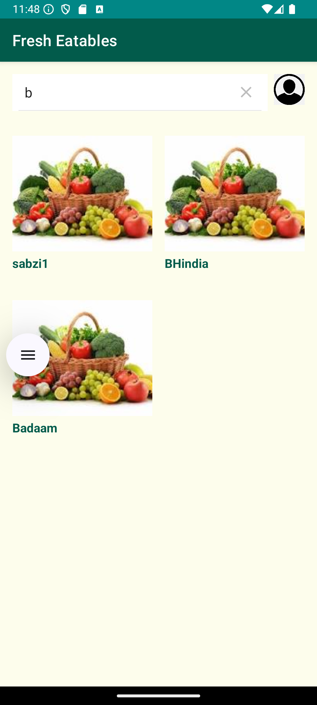

# Fresh Eatables

Fresh Eatables is an Android application that helps users browse and purchase fresh fruits, vegetables, and dry fruits conveniently. It provides an easy-to-navigate interface with categorized products and search functionality, making it simpler for users to find what they need.

## Features

- **Product Search**: Search for products by name.
- **Category Filter**: Filter products by categories such as Vegetables, Fruits, and Dry Fruits.
- **Product Details**: View detailed information about each product, including title, description, price, and image.
- **User Profile**: Navigate to the user profile from the home screen.

## Screenshots

### Home Screen


### Search Functionality



### Product Categories



### Product Details



## Installation

1. Clone the repository:

   ```bash
   git clone https://github.com/yourusername/fresh-eatables.git
2. Open the project in Android Studio.
Build and run the project on an Android device or emulator.

## Technologies Used

Java: For building the Android application logic.
XML: For designing UI layouts.
RecyclerView: For displaying the product list.
SearchView: For searching products.
NavigationView: For category filtering.

## License

This project is licensed under the MIT License


